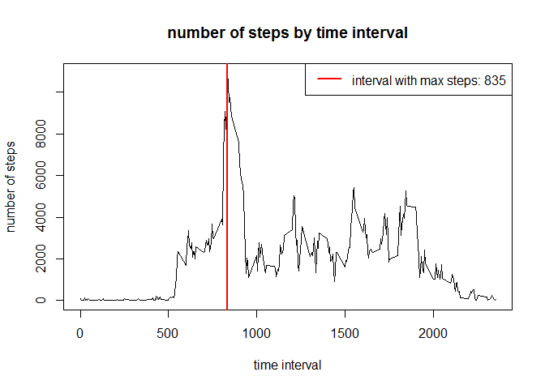

# Reproducible Research: Peer Assessment 1


## Loading and preprocessing the data

```r
library(dplyr)
library(ggplot2)
library(chron) #to use the is.weekend function
#unzip("activity.zip") if necessary
activity<-read.csv("activity.csv", colClasses = c("integer","Date","integer"))
activity<-tbl_df(activity)
act_by_day<-summarize(group_by(activity, date), daysteps=sum(steps, na.rm = TRUE))
act_by_time<-summarize(group_by(activity, interval), 
  intsteps=sum(steps, na.rm = TRUE), intmean=mean(steps, na.rm = TRUE))
```

## What is mean total number of steps taken per day?


```r
hist(act_by_day$daysteps, breaks=20, col = "cadetblue4",
  xlab="number of steps per day", ylab="frequency - number of days",
  main="steps per day freqency")
abline(v=mean(act_by_day$daysteps),lwd=2, col="black")
abline(v=median(act_by_day$daysteps),lwd=2, col="darkred")
legend(x="topright",c(paste0("mean: ",mean(act_by_day$daysteps))
        ,(paste0("median: ",median(act_by_day$daysteps)))), col=c("black", "darkred"), lwd=c(2,2))
```

<!-- -->

## What is the average daily activity pattern?

```r
plot(act_by_time$interval, act_by_time$intsteps,type = "l",
     xlab="time interval", ylab="number of steps", main="number of steps by time interval")
abline(v=top_n(act_by_time,1,intsteps)$interval,lwd=2,col="red")#find top interval by steps
legend(x="topright",
  paste0("interval with max steps: ", top_n(act_by_time,1,intsteps)$interval)
  , col="red", lwd=2)
```

<!-- -->

## Imputing missing values

```r
colSums(is.na(activity))
```

```
##    steps     date interval 
##     2304        0        0
```
**Note that missing data is always for an entire day.  It's either all there for the day, or all missing for the day.**


```r
na_by_day<-summarize(group_by(activity, date),
  total_na=sum(is.na(steps)),total_exists=sum(!is.na(steps)))
head(na_by_day, 10)
```

```
## # A tibble: 10 x 3
##          date total_na total_exists
##        <date>    <int>        <int>
## 1  2012-10-01      288            0
## 2  2012-10-02        0          288
## 3  2012-10-03        0          288
## 4  2012-10-04        0          288
## 5  2012-10-05        0          288
## 6  2012-10-06        0          288
## 7  2012-10-07        0          288
## 8  2012-10-08      288            0
## 9  2012-10-09        0          288
## 10 2012-10-10        0          288
```

```r
missed_days<-filter(na_by_day,total_exists==0)$date
missed_days
```

```
## [1] "2012-10-01" "2012-10-08" "2012-11-01" "2012-11-04" "2012-11-09"
## [6] "2012-11-10" "2012-11-14" "2012-11-30"
```

**Build new data frame where NA values are replaced by the average for that interval.**

```r
activity2<-  #get the interval mean steps we calculated earlier
  inner_join(activity, act_by_time[ ,c(1,3)], by="interval")
act_na<-filter(activity2,is.na(steps)) %>% #break out the NA rows
 mutate(steps=intmean) #updated to use the mean for that interval
activity2<-filter(activity2,!is.na(steps)) # rows with non-NA values
activity2<-bind_rows(activity2, act_na) #put the rows back together
activity2<- #arrange chronologically, drop extra col
  arrange(activity2[,1:3], date, interval) 
```
###Make a histogram of the total number of steps taken each day and Calculate
###and report the mean and median total number of steps taken per day.

```r
act_by_day2<-summarize(group_by(activity2, date), daysteps=sum(steps, na.rm = TRUE))
hist(act_by_day2$daysteps, breaks=20, col = "cadetblue4",
  xlab="number of steps per day", ylab="frequency - number of days",
  main="steps per day freqency (adjusted)")
abline(v=mean(act_by_day2$daysteps),lwd=2, col="black")
abline(v=median(act_by_day2$daysteps),lwd=2, col="darkred")
legend(x="topright",c(paste0("mean: ",mean(act_by_day2$daysteps))
        ,(paste0("median: ",median(act_by_day2$daysteps)))), col=c("black", "darkred"), lwd=c(2,2))
```

<!-- -->

###Do these values differ from the estimates from the first part of the assignment?
###What is the impact of imputing missing data on the estimates of the total
###daily number of steps?
**Yes, the values changed, and the mean and median increased (as would be expected).  Notable is that the mean and median are the same in the adjusted data set.  This is explained by the nature of the missing data and the updates.  Since data is always missing for entire days, when we group by day, each missing day is getting the same (mean) value, and the median is coming from one of those days we replaced with the mean ... thus they are exactly equal.**

## Are there differences in activity patterns between weekdays and weekends?
**create a variable to indicate weekday/weekend:**

```r
activity2<-mutate(activity2, weekends="weekday")
activity2[is.weekend(activity2$date),"weekends"]<-"weekend"
```
###Make a panel plot containing a time series plot of the
###5-minute interval and the average number of steps taken, averaged
###across all weekday days or weekend days.

**need an average by interval grouped by weekday/weekend, then plot**

```r
act_by_time2<-summarize(group_by(activity2,interval,weekends), 
  intsteps=sum(steps), intmean=mean(steps))

qplot(interval,intmean,data = act_by_time2,geom="line",facets=weekends~.)
```

<!-- -->

**We can see that weekday activity spikes earlier in the day, where weekends tend to ramp up a little later and are more smoothly distributed by hour.  (Maybe exercising before work at a desk job?  It's not a commute to work causing the activity spike since it isn't repeated at the end of the day.)**
